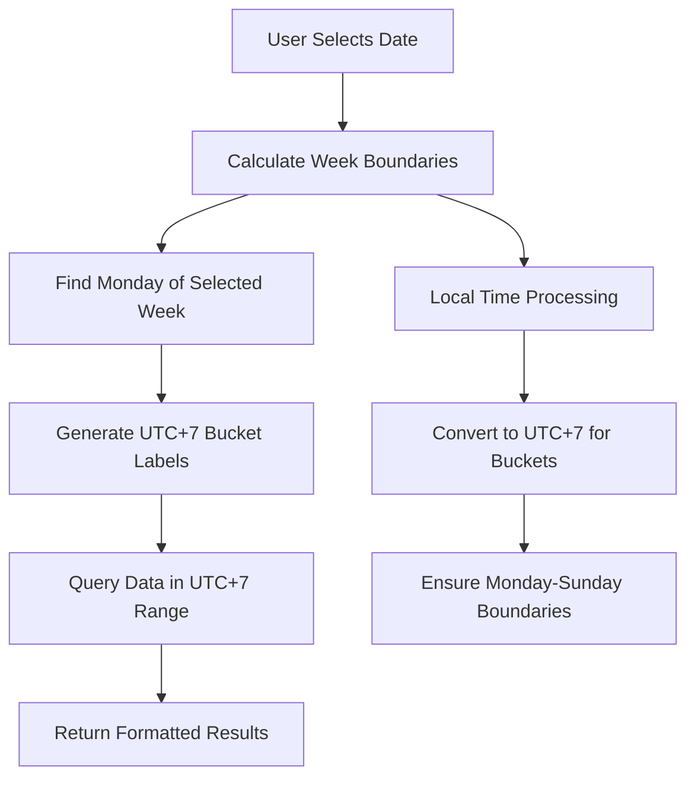

# ⚡ Electricity Meter Dashboard

A comprehensive web-based dashboard for managing electricity meters and monitoring power consumption in real-time.

## 🚀 Features

### 👥 User Management
- **Multi-user system** with role-based access control
- **Admin users** can manage all devices and users
- **Regular users** can only access assigned devices
- **Secure authentication** with bcrypt password hashing

### 📱 Device Management
- **Add/Edit devices** with serial number tracking
- **Device assignment** to specific users
- **Real-time status** monitoring
- **Location and description** tracking

### 📊 Real-time Monitoring
- **Live power consumption** data
- **Voltage, Current, Power, Energy** readings
- **WebSocket real-time updates**
- **Interactive charts** with Chart.js

### 📈 Analytics & Reports
- **Daily/Weekly/Monthly** consumption summaries
- **Power consumption trends**
- **Energy usage statistics**
- **Device performance metrics**
- **UTC+7 Timezone Support** for accurate regional reporting

## 🛠️ Installation

### Prerequisites
- Node.js (v14 or higher)
- npm
- MQTT Broker (Mosquitto)

### Setup

1. **Clone or navigate to dashboard directory:**
```bash
cd dashboard
```

2. **Make startup script executable:**
```bash
chmod +x start.sh
```

3. **Start the dashboard:**
```bash
./start.sh
```

The script will automatically:
- Check for Node.js and npm
- Install dependencies
- Initialize the database
- Start the server

## 🌐 Access

- **Dashboard URL:** http://localhost:3000
- **WebSocket:** ws://localhost:8080

### Default Admin Account
- **Username:** admin
- **Password:** admin123

## 📋 Database Schema

### Users Table
```sql
CREATE TABLE users (
    id INTEGER PRIMARY KEY AUTOINCREMENT,
    username VARCHAR(50) UNIQUE NOT NULL,
    email VARCHAR(100) UNIQUE NOT NULL,
    password_hash VARCHAR(255) NOT NULL,
    full_name VARCHAR(100),
    role VARCHAR(20) DEFAULT 'user',
    created_at DATETIME DEFAULT CURRENT_TIMESTAMP,
    updated_at DATETIME DEFAULT CURRENT_TIMESTAMP
);
```

### Devices Table
```sql
CREATE TABLE devices (
    id INTEGER PRIMARY KEY AUTOINCREMENT,
    serial_number VARCHAR(50) UNIQUE NOT NULL,
    device_id VARCHAR(50) NOT NULL,
    name VARCHAR(100),
    location VARCHAR(200),
    description TEXT,
    status VARCHAR(20) DEFAULT 'active',
    created_at DATETIME DEFAULT CURRENT_TIMESTAMP,
    updated_at DATETIME DEFAULT CURRENT_TIMESTAMP
);
```

### User-Device Relationships
```sql
CREATE TABLE user_devices (
    id INTEGER PRIMARY KEY AUTOINCREMENT,
    user_id INTEGER NOT NULL,
    device_id INTEGER NOT NULL,
    permission_level VARCHAR(20) DEFAULT 'read',
    created_at DATETIME DEFAULT CURRENT_TIMESTAMP,
    FOREIGN KEY (user_id) REFERENCES users (id),
    FOREIGN KEY (device_id) REFERENCES devices (id),
    UNIQUE(user_id, device_id)
);
```

### Meter Readings
```sql
CREATE TABLE meter_readings (
    id INTEGER PRIMARY KEY AUTOINCREMENT,
    device_id INTEGER NOT NULL,
    serial_number VARCHAR(50) NOT NULL,
    voltage REAL,
    current REAL,
    power REAL,
    energy REAL,
    timestamp DATETIME DEFAULT CURRENT_TIMESTAMP,
    FOREIGN KEY (device_id) REFERENCES devices (id)
);
```

## 🔌 API Endpoints

### Authentication
- `POST /api/auth/login` - User login
- `POST /api/auth/logout` - User logout
- `GET /api/auth/me` - Get current user

### User Management (Admin Only)
- `GET /api/users` - List all users
- `POST /api/users` - Create new user

### Device Management
- `GET /api/devices` - List user's devices
- `POST /api/devices` - Add new device (Admin)
- `PUT /api/devices/:id` - Update device (Admin)
- `POST /api/devices/:deviceId/assign` - Assign device to user (Admin)

### Meter Readings
- `GET /api/readings/:serialNumber` - Get device readings
- `GET /api/readings/:serialNumber/summary` - Get consumption summary

### Dashboard
- `GET /api/dashboard/stats` - Get dashboard statistics

## 🕐 Timezone Handling (UTC+7)

The dashboard implements comprehensive UTC+7 timezone support for accurate regional reporting and data consistency.

### Week Mode UTC+7 Implementation



### Timezone Logic Flow

1. **Input Processing**: User selects any day of the week
2. **Week Boundary Calculation**:
   - Find Monday of the selected week (UTC+7)
   - Set Sunday as week end (UTC+7)
3. **Bucket Generation**: Create 7 daily buckets in UTC+7
4. **Data Query**: Query database using UTC+7 time range
5. **Result Formatting**: Return data aligned with UTC+7 buckets

### Test Coverage

Run comprehensive tests with:
```bash
node test-week-utc7.js
```

**Test Cases Include:**
- ✅ Monday selection (week start)
- ✅ Wednesday selection (mid-week)
- ✅ Sunday selection (week end)
- ✅ Month boundary transitions
- ✅ Year boundary transitions

### Example Week Calculation

```
Input: Wednesday, January 17, 2024
Week Start: Monday, January 15, 2024 (UTC+7)
Week End: Monday, January 22, 2024 (UTC+7)
Buckets: [15/01, 16/01, 17/01, 18/01, 19/01, 20/01, 21/01]
```

## 🔧 Configuration

### Environment Variables
Create a `.env` file in the dashboard directory:

```env
PORT=3000
SESSION_SECRET=your-secret-key
MQTT_BROKER_URL=mqtt://localhost:1883
```

### MQTT Topics
The dashboard subscribes to:
- `meter/+/data` - Meter reading data
- `meter/+/status` - Device status updates

### Data Format
Meter reading data should be in JSON format:
```json
{
  "serial_number": "SN001",
  "device_id": "1",
  "voltage": 220.5,
  "current": 2.3,
  "power": 507.15,
  "energy": 1234.56,
  "timestamp": "2025-08-05T14:30:00.000Z"
}
```

## 🎨 Customization

### Styling
- Edit `public/styles.css` for custom styling
- Uses Bootstrap 5 for responsive design
- Custom gradients and animations

### Charts
- Uses Chart.js for data visualization
- Customizable chart options in `app.js`
- Real-time chart updates via WebSocket

## 🔒 Security

- **Session-based authentication**
- **Password hashing** with bcrypt
- **Role-based access control**
- **SQL injection protection** with parameterized queries
- **CORS configuration** for API access

## 📱 Mobile Support

- **Responsive design** for mobile devices
- **Touch-friendly** interface
- **Progressive Web App** features

## 🚀 Deployment

### PM2 Production Setup (Recommended)

This project includes PM2 configuration for production deployment:

#### Initial Setup
```bash
# Make deployment scripts executable
chmod +x deploy.sh restart.sh

# Run initial deployment
npm run deploy
# or
./deploy.sh
```

#### After Code Updates
```bash
# Pull latest changes
git pull origin main

# Restart with new code
npm run restart
# or
./restart.sh
```

#### PM2 Management Commands
```bash
# Start application
npm run pm2:start

# Stop application
npm run pm2:stop

# Restart application
npm run pm2:restart

# View logs
npm run pm2:logs

# Monitor application
npm run pm2:monit

# Check status
npm run pm2:status

# Delete process
npm run pm2:delete
```

#### PM2 Configuration
The `ecosystem.config.js` file contains:
- **Process name:** `meter-dashboard`
- **Auto-restart:** Enabled
- **Memory limit:** 1GB restart threshold
- **Environment:** Production settings
- **Log files:** `./logs/` directory
- **Instances:** 1 (single instance)

#### Logs
- **Error logs:** `./logs/err.log`
- **Output logs:** `./logs/out.log`
- **Combined logs:** `./logs/combined.log`

### Manual Production Setup
1. Set environment variables
2. Use PM2 for process management
3. Configure reverse proxy (nginx)
4. Enable HTTPS
5. Set up database backups

### Docker Deployment
```dockerfile
FROM node:16-alpine
WORKDIR /app
COPY package*.json ./
RUN npm install
COPY . .
EXPOSE 3000
CMD ["npm", "start"]
```

## 🐛 Troubleshooting

### Common Issues

1. **MQTT Connection Failed**
    - Check if Mosquitto is running
    - Verify MQTT broker URL
    - Check firewall settings

2. **Database Errors**
    - Ensure write permissions to data directory
    - Check SQLite installation
    - Verify database file path

3. **WebSocket Connection Issues**
    - Check if port 8080 is available
    - Verify WebSocket server is running
    - Check browser console for errors

4. **HTTPS/Mixed Content Issues**
    - Ensure SSL certificates are properly configured
    - Check `server.js` for HTTPS setup
    - Verify API_BASE URLs use HTTPS in production
    - Disable COOP headers if needed: `Cross-Origin-Opener-Policy: unsafe-none`

5. **Timezone/Date Display Issues**
    - Verify UTC+7 implementation in `routes/readings.js`
    - Run `node test-week-utc7.js` to validate week calculations
    - Check browser timezone settings
    - Ensure date picker selections align with UTC+7 boundaries

6. **UI/Dropdown Issues**
    - Check z-index values in `public/assets/css/style.css`
    - Verify dark mode toggle functionality
    - Ensure navbar and dropdown styling is consistent

### Logs
- Server logs are displayed in the console
- Check browser developer tools for client-side errors
- Database queries are logged for debugging

## 🆕 Recent Updates & Improvements

### v2.1.0 - UTC+7 Timezone & UI Enhancements

#### ✅ **UTC+7 Timezone Support**
- **Week Mode Fix**: Corrected Monday-Sunday boundaries for UTC+7
- **Bucket Generation**: Proper UTC+7 date labels for weekly statistics
- **Edge Case Handling**: Month and year boundary transitions
- **Test Coverage**: Comprehensive test suite (`test-week-utc7.js`)

#### ✅ **HTTPS & Security Improvements**
- **SSL Implementation**: Self-signed certificate setup for development
- **Mixed Content Fix**: Resolved HTTP/HTTPS protocol conflicts
- **COOP Headers**: Disabled for cross-origin compatibility
- **CORS Configuration**: Updated for secure API access

#### ✅ **UI/UX Enhancements**
- **Dark Mode**: System-following theme with manual override
- **Dropdown Z-Index**: Fixed user dropdown visibility issues
- **Responsive Design**: Improved mobile compatibility
- **Theme Consistency**: Proper styling across light/dark modes

#### ✅ **Code Quality**
- **Error Handling**: Enhanced error reporting and logging
- **Performance**: Optimized timezone calculations
- **Documentation**: Comprehensive README updates with flowcharts
- **UTC+7 Consistency**: Fixed month and year mode bucket generation to use UTC+7

### Files Modified
- `routes/readings.js` - UTC+7 week/month/year logic implementation
- `server.js` - HTTPS setup and COOP header fixes
- `public/assets/css/style.css` - Dark mode and z-index fixes
- `public/assets/js/ui.dashboard.js` - Theme toggle functionality
- `public/assets/components/nav.html` - Theme-aware navbar styling
- `README.md` - Documentation updates
- `test-week-utc7.js` - Week mode test suite
- `test-month-utc7.js` - Month mode test suite
- `test-year-utc7.js` - Year mode test suite

## 📞 Support

For issues and questions:
1. Check the troubleshooting section
2. Review the API documentation
3. Check browser console for errors
4. Verify MQTT broker connectivity
5. Run timezone tests: `node test-week-utc7.js`

## 🔄 Updates

To update the dashboard:
1. Stop the server (Ctrl+C)
2. Pull latest changes
3. Run `npm install` if dependencies changed
4. Restart with `./start.sh`

---

**Happy Monitoring! ⚡📊** 